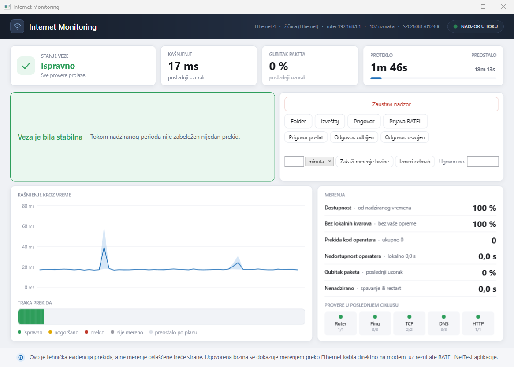
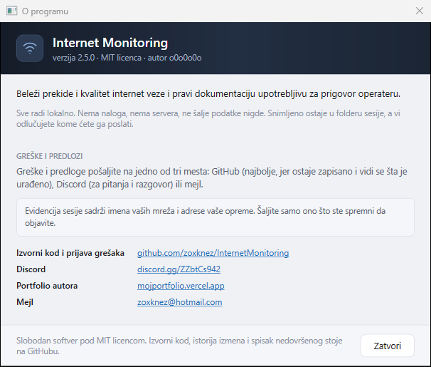

# Internet Monitoring 2.7

[](https://github.com/zoxknez/InternetMonitoring/actions/workflows/ci.yml)
[](LICENSE)
[](https://dotnet.microsoft.com/download)
[](#windows-servis)

Alat koji beleži prekide i kvalitet internet veze, i pravi dokumentaciju upotrebljivu
za prigovor operateru.

Sve radi lokalno. Nema naloga, nema servera, nema slanja podataka bilo gde. Nadzor radi
i kada interneta nema - to mu je i svrha.

> **Stanje: v2.7.** Merni engine, klasifikacija kvarova, konzolni pokretač, trajno
> skladištenje sa hash-lancem, izveštaji u HTML-u i PDF-u, Windows servis, grafički
> interfejs, bežični sloj i pravni modul rade. Merenje brzine meri **oba smera i kašnjenje
> pod opterećenjem**, stoji u redu dok je veza zauzeta, i ulazi u izveštaj sa ocenom
> valjanosti. Zakazano merenje izvršava servis, pa prozor i konzola mogu biti zatvoreni.
> Dnevnik predmeta čuva rokove između pokretanja.

Primer izveštaja: [PDF](docs/primer-izvestaja.pdf) &middot; [HTML](docs/primer-izvestaja.html).
Iz prave sesije, sa jednom izmenom: ime računara je zamenjeno neutralnim, da u repozitorijumu
ne stoji ime tuđe mašine. Merenja, prekidi, otisci i verzije modela su onakvi kakvi su
snimljeni.

Šta je nedovršeno i zašto: [docs/PREOSTALO.md](docs/PREOSTALO.md).
Istorija izmena: [CHANGELOG.md](CHANGELOG.md).
Pravila koja program ne sme da prekrši, i gde svako ima test:
[docs/INVARIJANTE.md](docs/INVARIJANTE.md).
Šta dolazi u 3.0 i zašto tim redom: [docs/ROADMAP-3.0.md](docs/ROADMAP-3.0.md).



---

## Šta ovaj alat radi drugačije

**Razlikuje dokle je problem izolovan.** Većina alata kaže samo „interneta nema". Ovaj
razdvaja kvar na vašem računaru, na Wi-Fi vezi, na ruteru i **iza rutera** - a prigovor nosi
samo ono poslednje.

Namerno „iza rutera", a ne „kod operatera". Merenje sa vašeg računara može da isključi putanju
između računara i rutera; ne može da vidi WAN stranu samog rutera, njegov firmver, PPPoE sesiju
ni NAT tabelu - a sve to odavde izgleda isto kao i prekid dalje u mreži. Nalaz koji imenuje
krivca daje operateru najlakši mogući odgovor; nalaz koji kaže šta je izmereno ne daje.

Najvažniji primer: **ruter kome otkaže Wi-Fi dok mu WAN veza radi.** Računar se
diskonektuje i to izgleda identično kao da ste izašli iz dometa. Razlika je u tome da li
se mreža uopšte još emituje. Kada SSID nestane iz skeniranja a radio na računaru je pročitan
kao uključen - uzrok je ruter, a ne domet. Ako se stanje radija ne može pročitati, alat to
kaže i ne pravi nalaz o opremi.

**Meri i ono što brzina ne pokazuje.** Veza koja postiže ugovorenu brzinu i dalje može biti
neupotrebljiva za pozive i igre, i uzrok je gotovo uvek isti: prevelik bafer negde na putanji
se pod opterećenjem napuni, pa sve iza njega čeka. To se ne vidi u brzini nego u odzivu
**tokom** prenosa, upoređenom sa odzivom iste veze dok miruje. Merenje zato optereti vezu u
oba smera i meri kašnjenje pod opterećenjem - isto što rade i regulatorne metodologije
(FCC Measuring Broadband America, Ofcom/SamKnows), a što običan „speed test" ne radi.

**Ne pripisuje operateru sopstveno zagušenje.** Uz svaki uzorak beleži se koliko je sam
računar trošio vezu, jer preuzimanje od 25 MB/s puni iste bafere kao i smetnja - a prekid
zabeležen u tom trenutku operater obara jednim pitanjem. Prekidi koji se poklope sa sopstvenim
saobraćajem nose nižu pouzdanost i to piše u izveštaju, a period dok alat sam meri brzinu se
izuzima iz ocene.

**Ne izmišlja prekide.** Filtriran ping je najčešći lažni pozitiv - mnoge mreže namerno
blokiraju ICMP dok saobraćaj radi savršeno. Ako ping padne a TCP i TLS prolaze, to se
beleži kao `Ping je filtriran`, nikad kao prekid.

**Ne izmišlja preciznost.** Merenje je diskretno, pa se tačan početak prekida nalazi
negde između poslednjeg ispravnog i prvog neispravnog uzorka. Zato svaki prekid nosi tri
broja: donju granicu koja se ne može osporiti, gornju granicu, i središnju procenu koja
uvek leži između njih.

**Ne broji spavanje računara kao ispravan rad.** Ako je računar spavao šest sati, tada
ništa nije mereno. Računati to kao dostupnost naduvava rezultat u korist korisnika - a to
je upravo mana zbog koje operater može odbaciti inače ispravan izveštaj. Dostupnost se
zato računa u odnosu na stvarno nadzirano vreme, a pauze se prikazuju odvojeno.

**Vreme se meri nezavisnim brojačem.** Ako se sistemski sat pomeri - NTP korekcija ili
ručna izmena - to se zabeleži, ali trajanja ostaju tačna jer se nikad ne računaju iz
zidnog sata.

---

## Pokretanje

Potreban je [.NET 10 SDK](https://dotnet.microsoft.com/download).

```bash
dotnet run --project src/IEM.Cli -- --trajanje 5m
```

Opcije:

| Parametar | Značenje |
|---|---|
| `-t, --trajanje <vreme>` | `45s`, `30m`, `6h`, `48h`, `3d` ili `beskonacno`. Podrazumevano `48h`. |
| `-i, --interfejs <ime>` | Adapter koji se nadzire. Podrazumevano onaj koji nosi podrazumevanu rutu. |
| `-o, --izlaz <folder>` | Gde se snimaju sesije. Podrazumevano `Radna površina\InternetEvidence`. |
| `--bez-zapisa` | Ne snima ništa. Samo za brzu proveru. |
| `--brzina [Mbit/s]` | Meri preuzimanje, slanje i kašnjenje pod opterećenjem. Uz ugovorenu brzinu daje i ocenu: `--brzina 100`, ili par kako piše u ugovoru: `--brzina 100/20`. |
| `--slanje <Mbit/s>` | Ugovorena brzina slanja, ako nije data uz `--brzina`. |
| `--bez-slanja` | Meri samo preuzimanje. Prepolovljuje utrošak podataka, za veze koje se plaćaju po gigabajtu. |
| `--cekaj <vreme>` | Koliko dugo `--brzina` čeka da veza utihne. Podrazumevano 10m; `0` znači odustani odmah. |
| `--zakazi <vreme>` | Koliko pre merenja sačekati, pa tek onda meriti (npr. `--zakazi 2h`). Hvata pad brzine u određeno doba dana. Konzola mora ostati otvorena - za zakazivanje bez otvorenog prozora koristi se servis (`zakazi-merenje`). |
| `--predmet` | Prikazuje stanje predmeta i rokove iz dnevnika. |
| `--podnet <datum>` | Beleži dan podnošenja prigovora. Primer: `--podnet 12.09.2026.` |
| `--odgovor <datum>` | Beleži dan odgovora operatera. |
| `--usvojen` / `--odbijen` | Beleži ishod odgovora operatera. |
| `--prijava-ratel <folder>` | Priprema prijavu RATEL-u iz sesije, kad je to zakonom moguće. |
| `-d, --detaljno` | Ispisuje svaki uzorak sa razlaganjem po proverama. |
| `--wifi` | Ispisuje šta bežični sloj vidi - mreža, signal, pristupna tačka, vidljive mreže - pa izlazi. |
| `-r, --izvestaj <folder>` | Ponovo pravi izveštaj za postojeću sesiju. |
| `-v, --proveri <folder>` | Proverava integritet postojeće sesije i izlazi. |
| `-p, --pomoc` | Pomoć. |

Kratka provera pre pravog testa:

```bash
dotnet run --project src/IEM.Cli -- --trajanje 5m --detaljno
```

### Merenje brzine

```bash
dotnet run --project src/IEM.Cli -- --brzina 100 --slanje 20
```

Merenje čeka da veza utihne, pa je namerno zauzme do kraja: prvo preuzimanje, pa slanje, po
deset sekundi i tri paralelne veze po smeru. Uz to meri odziv dok veza miruje i dok je
opterećena, i prijavljuje razliku - to je nalaz koji objašnjava „internet radi, ali zapinje".

Merenje se zapisuje uz poslednju sesiju (`MerenjeBrzine.json`) i ulazi u njen izveštaj sa
ocenom. Košta podataka onoliko koliko veza stigne da prenese za dvadeset sekundi; na
gigabitnoj vezi to je oko 1 GB. `--bez-slanja` prepolovljuje taj trošak.

---

## Kako se proverava doslednost paketa

Svaka sesija pravi svoj folder:

```
Sesija_20260813_182150/
├── Izvestaj.html             izveštaj za čitanje, sa grafikonima
├── Izvestaj.pdf              isti izveštaj, za štampu i slanje uz prigovor
├── Rezime.txt                sažetak
├── Prekidi.csv               tabela prekida sa granicama trajanja
├── Merenja.csv               kašnjenje kroz vreme
├── SirovaEvidencija.jsonl    sam dokaz - dodaje se samo na kraj, sa lancem otisaka
├── sesija.db                 izvedeni indeks za izveštaje i interfejs
├── Provera-lanca.txt         rezultat provere integriteta
└── SHA256SUMS.txt            otisci svih fajlova u paketu

Dokazi_Sesija_20260813_182150.zip   isti sadržaj, spremno za slanje
```

Izveštaj postoji u dva oblika sa istim sadržajem: `Izvestaj.html` za čitanje na ekranu i
`Izvestaj.pdf` za štampu i prilaganje uz prigovor. PDF se pravi direktno, a ne štampanjem
HTML-a iz pregledača - pregledač u dokument upisuje svoje margine, razmeru i zaglavlje,
izostavlja pozadine ako korisnik ne čekira kućicu, i preseca tabele bez ponavljanja
zaglavlja, pa dvoje ljudi šalje dva različita dokumenta. Fontovi su ugrađeni u sam program
(Liberation, SIL OFL 1.1), da naša slova ne zavise od toga šta je instalirano na mašini.

> Napomena o otiscima: sadržaj PDF-a je reproduktivan, ali sam fajl nije bajt po bajt
> identičan između dve izrade - format nosi interne oznake koje se generišu iznova pri
> svakom upisu. `SirovaEvidencija.jsonl` i `Izvestaj.html` jesu identični. Isto piše i u
> samom izveštaju.

Izveštaj se pravi automatski na kraju sesije. Ako nešto pođe naopako, sirova evidencija
ostaje netaknuta i izveštaj se pravi naknadno:

```bash
dotnet run --project src/IEM.Cli -- --izvestaj "putanja\do\Sesija_20260813_182150"
```

Svaki red sirove evidencije sadrži otisak prethodnog reda i svoj sopstveni. Izmena bilo
kog ranijeg reda narušava sve otiske posle njega, pa se izmena ne može ograničiti na jedno
mesto.

Proveru može pokrenuti bilo ko - i vi, i tehničar operatera:

```bash
dotnet run --project src/IEM.Cli -- --proveri "putanja\do\Sesija_20260813_182150"
```

Ispisuje `ISPRAVAN` ili `NARUŠEN` sa brojem prvog izmenjenog reda, i vraća izlazni kod
`0` odnosno `1` da se može koristiti i u skripti.

**Šta ovo pokazuje, a šta ne.** Pokazuje da je lanac otisaka unutrašnje dosledan: nijedan
zapis nije izmenjen a da to ne pokvari sve otiske posle njega. To je provera doslednosti, a
ne dokaz porekla - `SHA256SUMS.txt` i sam lanac stoje u istom folderu u koji se piše, pa bi
onaj ko može da izmeni zapis mogao da preračuna i jedno i drugo. Nezavisan dokaz vremena i
porekla zahteva potpis i vremenski žig treće strane, što ovo izdanje ne radi; planirano je
za 3.0.0.

Sirova evidencija je izvor istine; SQLite baza je izvedeni indeks i može se ponovo
napraviti iz nje. Zato se svaki zapis prvo upisuje u lanac, pa tek onda u bazu, i zato se
lanac forsira na disk pri svakoj promeni stanja - nadzor čija je svrha da preživi nestanak
struje nema pravo da drži nalaze u memoriji.

---

## Grafički interfejs

```bash
dotnet run --project src/IEM.App
```

Prozor sam bira kako radi. Ako je servis instaliran, on je samo prozor u nadzor koji ide
svojim tokom - zatvaranje ne zaustavlja test, i to piše na vrhu prozora umesto da se
podrazumeva. Ako servis nije instaliran, nadzor se izvršava u samom prozoru, sa istim
lancem i istim izveštajem, uz jasno upozorenje da zatvaranje prekida test.

Ikona u sistemskoj traci menja boju po verdiktu i **oblik** po stanju - puna dok test
traje, prazan prsten kad ne radi. Boja sama bila bi beskorisna nekome ko ne razlikuje
crveno od zelenog.

Grafikoni se crtaju direktno, bez biblioteke, istim vizuelnim jezikom kao izveštaj: kad
korisnik vidi crvenu traku u prozoru pa otvori izveštaj, mora prepoznati istu sliku.
Kašnjenje se prikazuje kao raspon od najbržeg do najsporijeg odziva sa prosekom kroz njega
- sam prosek bi izgladio upravo one skokove koji kvare pozive i video.

Kad se prozor otvori usred testa, istorija se učitava iz baze sesije, pa se vidi ceo test,
a ne samo ono što se desilo otkad je prozor otvoren.

---

## Windows servis

Za pravi 48-časovni test nadzor ne sme da zavisi od otvorenog prozora, prijavljenog
korisnika ni od toga da se računar neće restartovati. Zato postoji servis.

Pravljenje instalacionog paketa (ne traži administratorska prava):

```bash
powershell -ExecutionPolicy Bypass -File build/publish.ps1
```

Skripta proverava zaključane zavisnosti, pokrene testove, pa objavi servis, prozor i konzolu u
`artifacts/win-x64/` i napravi arhivu sa kontrolnim zbirom. Instalater traži tačno taj
raspored - ručni `dotnet publish` u drugi folder on ne pronalazi.

Instalacija traži administratorska prava jednom - kopira aplikaciju u
`C:\Program Files\InternetEvidenceMonitor`, registruje servis i dodeljuje mu prava upisa
na folder sesija:

```bash
powershell -ExecutionPolicy Bypass -File build/install/install.ps1
```

Zahtev za sesiju se pravi kao **običan korisnik**, bez administratorskih prava:

```bash
"C:\Program Files\InternetEvidenceMonitor\service\InternetEvidenceService.exe" start-session 48h
```

```bash
sc start InternetEvidenceMonitor
```

Zakazano merenje brzine takođe preuzima servis, pa ni prozor ni konzola ne moraju ostati
otvoreni - što je i bila poenta zakazivanja, jer se merenje najčešće zakazuje za sate kada
niko nije budan:

```bash
"C:\Program Files\InternetEvidenceMonitor\service\InternetEvidenceService.exe" zakazi-merenje 3h 100/20
```

Zahtev stoji na disku (`merenje.json`) i preživljava restart. Ako u zakazano vreme veza bude
zauzeta, čeka se do deset minuta da utihne, pa se merenje odbija - izmerena bi bila preostala
brzina, ne raspoloživa. Ako je računar bio ugašen i propustio termin za više od sat vremena,
merenje se ne izvršava naknadno: figura zapisana u podne ne odgovara zahtevu koji je značio
tri ujutru. Otkazivanje: `otkazi-merenje`.

Uklanjanje (snimljene sesije ostaju):

```bash
powershell -ExecutionPolicy Bypass -File build/install/uninstall.ps1
```

Servis radi dok se sesija ne završi, pa se **sam zaustavlja** i napravi izveštaj.

**Šta se dešava ako se računar restartuje usred testa.** Sesija se nastavlja tačno tamo
gde je stala: isti folder, isti lanac, ista numeracija prekida i uzoraka. Vreme dok
nadzor nije radio beleži se kao pauza sa uzrokom `MonitorNotRunning` - nikada kao prekid
internet veze, jer tada ništa nije mereno.

To radi zahvaljujući dvema stvarima. Zahtev za sesiju (`zahtev.json`) stoji na disku i
uklanja se tek kad sesija dođe do planiranog kraja - zato restart posle završenog testa
ne pokreće tiho novi. A periodične kontrolne tačke u samom lancu čuvaju tekuće zbirove,
pa se nastavak ne oslanja na približno izvođenje iz baze nego na tačne, već zapisane
brojke.

Servis radi pod nalogom `NT AUTHORITY\LocalService`, ne `LocalSystem`. Alat koji šalje
ping-ove i piše u sopstveni folder nema potrebe za najjačim nalogom na računaru. Provereno
na stvarnoj instalaciji - pod tim nalogom uspevaju **sve** provere: ICMP ka mrežnom prolazu
i ka spoljnim metama, TCP, TLS rukovanje, sva tri DNS puta i HTTP.

Stanje se može očitati u svakom trenutku, preko imenovanog kanala
`InternetEvidenceMonitor.status`, komandama `STATUS`, `LIVE`, `SPEED`, `PING` i `HELLO`. Zahtev nosi
verziju protokola, pa interfejs i servis različitih verzija to kažu jasno umesto da izgleda
kao da servis ne radi. Veza je jednosmerna:
interfejs je čitalac nadzora, nikad njegov vlasnik - zatvaranje prozora ne sme zaustaviti
test koji traje.

---

## Kako meri

Provere se pokreću **paralelno i asinhrono**, pa ciklus traje otprilike koliko najsporija
provera, a ne koliko njihov zbir.

Brze provere idu u svakom ciklusu: ping ka mrežnom prolazu, ping ka tri nezavisne mete u
tri različite mreže (Cloudflare, Google, Quad9) i TCP konekcije. Spore provere - DNS, TLS
rukovanje i HTTP - teku u pozadini i nikada ne ulaze u putanju merenja. Rezultat stariji
od zadatog praga prijavljuje se kao „nije mereno", a ne kao svež nalaz.

DNS se pita na tri strane odvojeno: resolver koji je dodelio DHCP, javni resolver direktno
preko UDP-a, i sistemski. To je jedini način da se razlikuje „DNS operatera je pao" od
„DNS ne radi nigde" - dva različita kvara sa različitim ishodom.

Učestalost se prilagođava stanju:

```
Stabilno        1000 ms
Sumnjivo         250 ms   nešto je palo
Pojačano         100 ms   drugi uzastopni neuspeh
Prekid           100 ms   potvrđen prekid
Oporavak         250 ms   30 s nakon povratka, pa nazad na stabilno
```

Zdrava veza se meri jednom u sekundi, a granice prekida sa rezolucijom ispod sekunde.

---

## Struktura

```
src/
  IEM.Core/          merni engine, klasifikacija, incidenti, ocena pouzdanosti, merenje brzine
  IEM.Storage/       hash-lanac, provera integriteta, SQLite indeks, nastavak sesije, protokol kanala
  IEM.Evidence/      HTML i PDF izveštaj, CSV izvoz, ZIP paket, kontrolni zbirovi
  IEM.Legal/         prigovor, rokovi, dnevnik predmeta, prijava RATEL-u
  IEM.Windows/       Native Wi-Fi, rute, vezani ping - sve što je vezano za Windows
  IEM.Service/       Windows servis, obrada spavanja, kanal za status, zakazano merenje
  IEM.App/           grafički interfejs, tray ikona, grafikoni
  IEM.Cli/           konzolni pokretač
tests/
  IEM.Core.Tests/    472 testa, bez mreže, bez Windows-a, deterministički
  IEM.App.Tests/     20 testova ponašanja prozora, sa lažnim hostom
legacy/
  InternetEvidenceMonitor.ps1   PowerShell verzija 1.0
```

`IEM.Core` nema zavisnosti od Windows-a ni od grafičkog interfejsa, pa se ceo katalog
kvarova testira bez mreže. Bežični detalji - jačina signala, BSSID i pre svega da li se
SSID još emituje - traže Windows Native Wi-Fi API, ali kroz `IEM.Windows` prolaze samo
pozivi ka sistemu: pravila koja od tih očitavanja prave nalaz stoje u `IEM.Core` i testiraju
se bez radija. Ta pravila odlučuju da li je nestala mreža kvar rutera ili korisnik van
dometa, pa je bilo pogrešno da se mogu proveriti samo šetnjom po stanu sa laptopom.

Testovi:

```bash
dotnet test
```

---

## Šta sledi

| Faza | Sadržaj |
|---|---|
| ~~P1~~ | ~~Trajno skladištenje: JSONL sa hash-lancem, SQLite, nastavak posle pada~~ - gotovo |
| ~~P2~~ | ~~Izveštaji: HTML, PDF, CSV izvoz, ZIP paket~~ - gotovo |
| ~~P3~~ | ~~Windows servis, nastavak sesije posle restarta, obrada spavanja, kanal za status~~ - gotovo |
| ~~P4~~ | ~~Grafički interfejs, ikona u sistemskoj traci, grafikoni uživo~~ - gotovo |
| ~~P5~~ | ~~RSSI i skeniranje SSID-a, trasa, IPv6, UPnP status rutera~~ - gotovo (merenje brzine ostaje) |
| ~~P5b~~ | ~~Merenje brzine, odloženo dok je veza u upotrebi~~ - gotovo (--cekaj) |
| ~~P6~~ | ~~Provera valjanosti merenja u izveštaju~~ - gotovo (MerenjeBrzine.json + sekcija) |
| ~~P7~~ | ~~Pravni modul: prigovor, rokovi, dnevnik slučaja, prijava RATEL-u~~ - gotovo |
| ~~P8~~ | ~~Slanje i kašnjenje pod opterećenjem; zakazano merenje u servisu~~ - gotovo |
| ~~P9~~ | ~~Sopstveni saobraćaj u evidenciji; testovi ponašanja prozora~~ - gotovo |
| P10 | Instalater i distribucija |

### Preuzimanje i potpis

Gotove arhive idu u [Releases](https://github.com/zoxknez/InternetMonitoring/releases), za
`win-x64` i `win-arm64`, uz `.zip.sha256` za svaku. Preuzeto se proverava sa
`Get-FileHash <arhiva> -Algorithm SHA256` i zbir mora odgovarati. (U repozitorijumu ih nema:
folder `artifacts/` je lokalni izlaz gradnje i namerno je izvan git-a - tri stotine megabajta
po izdanju nemaju šta da traže u istoriji koda.)

Program **nije digitalno potpisan**: ovo je hobi projekat za uži krug, a potpis košta koliko i
sam projekat ne vredi. Posledica se vidi odmah - Windows SmartScreen upozorava na nepoznatog
izdavača, pa se preuzeti ZIP prvo odblokira:

```bash
Unblock-File .\InternetMonitoring-2.7.2-win-x64.zip
```

Ako se namena ikad promeni, polazna tačka je Azure Artifact Signing.

Sami da napravite arhivu, iz kopije repozitorijuma:

```bash
powershell -ExecutionPolicy Bypass -File build/publish.ps1
```

### Šta je urađeno u v2.2

Dve revizije koda pronašle su osam ozbiljnih problema, i svi su ispravljeni. Zajednička nit
im je bila ista: alat je na nekoliko mesta bio samouvereniji nego što su merenja dozvoljavala.

| Bilo | Sada |
|---|---|
| Ciklus je čekao svaki probe, pa je trajao ~2 s uprkos kadenci od 100 ms | Probe rade na sopstvenim petljama; otkucaj čita policu i ništa ne čeka |
| Keširan uspeh star do 60 s je kratak prekid pretvarao u „filtriran ping" | Uspeh zabeležen pre početka neuspeha više ne dokazuje da veza radi |
| Probe nisu bile vezane za nadzirani adapter | Ruta se razrešava po meti; TCP, UDP i ICMP izlaze sa poznate izvorišne adrese |
| Šestočasovno spavanje računara davalo je šest sati „nedostupnosti operatera" | Pauza nadzora preseca prekid; nijedno trajanje je ne prelazi |
| Izveštaj se pravio iz baze, pa je brisanje sirovog loga prolazilo nekažnjeno | Bez sirovog lanca nema izveštaja; indeks se rekonstruiše iz lanca |
| „Potvrđeni prekidi na strani operatera" | „Prekidi izolovani iza vaše opreme" - ono što se sa računara zaista može izmeriti |
| Pad procesa usred prekida gubio je otvoreni incident | Otvoreni segment se rekonstruiše iz repa lanca |
| Prelazak sa Wi-Fi-ja na Ethernet čitao se kao oporavak za 2 s | Promena adaptera tokom prekida se obeležava; zapis prestaje biti čist dokaz o jednoj vezi |

Uz to: pouzdanost je sada dvodimenzionalna (podrška i pokrivenost) i prikazuje se kao pojas,
ne kao lažno precizan procenat; verzije zavisnosti su zaključane; a izveštaj navodi kojom
verzijom modela je zaključak donet, da bi se isti nalaz mogao ponoviti godinama kasnije.

---

## Granice ovog alata

Ovo je tehnička evidencija, ne merenje ovlašćene treće strane niti zapis potpisan od
strane operatera.

**Za dokazivanje ugovorene brzine ovaj alat nije dovoljan.** Pravilnik traži merenje
preko Ethernet kabla povezanog direktno na modem - bežično merenje se za tu svrhu ne
priznaje. Uz prigovor zbog kvaliteta internet usluge RATEL navodi i rezultate merenja
[RATEL NetTest](https://nettest.ratel.rs/home) aplikacije, po proceduri od tri dana sa po
dva merenja pre i posle podne. Ovaj alat je dopuna tome, ne zamena.

Nadzor **prekida** radi i preko Wi-Fi mreže i predstavlja valjan tehnički dokaz - Ethernet
zahtev važi za merenje protoka, ne za evidenciju prekida.

**Sopstveni saobraćaj se meri i beleži, ali ga ne izbegavajte manje zbog toga.** Kad računar
sam povlači nešto veliko, bafer se napuni, provere kasne i to izgleda kao smetnja. Alat sada
uz svaki uzorak beleži koliko je sam računar trošio vezu, pa prekid koji se poklopio sa
sopstvenim preuzimanjem **ne prolazi kao čist dokaz** protiv operatera: pouzdanost pada, a
izveštaj kaže „tokom prekida je i sam računar koristio vezu (do X MB/s)". Merenje brzine se i
dalje ne izvršava na zauzetoj vezi, a period sopstvenog merenja se izuzima iz ocene umesto da
se upiše kao pogoršanje.

Prigovor je ipak najuverljiviji ako je nadzor radio dok računar nije radio ništa drugo.

---

## Licenca i doprinosi

[MIT](LICENSE). Radite s njim šta hoćete, samo zadržite obaveštenje o autorstvu.

Tuđi rad ugrađen u program - fontovi i biblioteke, sa licencama - popisan je u
[NOTICE.md](NOTICE.md). Fontovi Liberation (SIL OFL 1.1) su ugrađeni u sam program, pa licenca
putuje sa svakom objavljenom arhivom.

Ako nešto menjate ili prijavljujete:

- [CONTRIBUTING.md](CONTRIBUTING.md) - pravila koja se ne pregovaraju, i zašto
- [SECURITY.md](SECURITY.md) - šta je ozbiljan propust i kako se prijavljuje privatno
- [CODE_OF_CONDUCT.md](CODE_OF_CONDUCT.md) - kratko

Jedno pravilo stoji iznad ostalih: **alat sme da tvrdi samo ono što je izmerio.** Izveštaj iz
ovog programa neko će poslati svom operateru; sve u kodu služi tome da taj dokument preživi
čitanje nekoga ko u njemu traži grešku.

---

## O aplikaciji

| | |
|---|---|
| **Verzija** | 2.7.2 |
| **Autor** | **o0o0o0o** ([GitHub](https://github.com/zoxknez)) |
| **Licenca** | [MIT](LICENSE) |
| **Platforma** | Windows 10/11, x64 i ARM64. Ne traži instaliran .NET - objavljene arhive nose svoj runtime. |
| **Šta radi** | Beleži prekide i kvalitet internet veze i pravi dokumentaciju upotrebljivu za prigovor operateru. |
| **Šta ne radi** | Ne šalje podatke nigde, ne traži nalog, ne koristi server. Snimljeno ostaje u folderu sesije, a vi odlučujete kome ćete ga poslati. |

Ista ova informacija stoji i u samom programu - dugme **O programu** u zaglavlju prozora, i u
meniju ikone u sistemskoj traci - kao i u konzoli (`iem --pomoc`). Tekst i linkovi dolaze sa
jednog mesta u kodu (`AppInfo`), pa ne mogu da se raziđu između prozora, konzole i README-a.



### Greške, predlozi, pitanja

Tri mesta, po nameni:

| Gde | Za šta |
|---|---|
| [GitHub Issues](https://github.com/zoxknez/InternetMonitoring/issues) | **Najbolje.** Greške i predlozi ostaju zapisani i vidi se šta je od njih urađeno. Postoje šabloni koji pitaju ono što je potrebno da bi prijava bila upotrebljiva. |
| [Discord](https://discord.gg/ZZbtCs942) | Pitanja, razgovor, pomoć oko pokretanja i tumačenja izveštaja. |
| [zoxknez@hotmail.com](mailto:zoxknez@hotmail.com) | Ako vam GitHub i Discord ne odgovaraju, ili je stvar privatna. |

Za bezbednosne propuste postoji poseban put, opisan u [SECURITY.md](SECURITY.md) - privatna
prijava, ne javni issue.

**Pre nego što pošaljete evidenciju:** folder sesije sadrži imena vaših mreža (SSID), adrese
vaše opreme (BSSID, MAC, ruter) i vremena kada ste bili na mreži. Pošaljite samo ono što ste
spremni da objavite - za većinu prijava dovoljni su verzija, opis i par redova iz
`SirovaEvidencija.jsonl`.

### Ostali projekti autora

[mojportfolio.vercel.app](https://mojportfolio.vercel.app)
